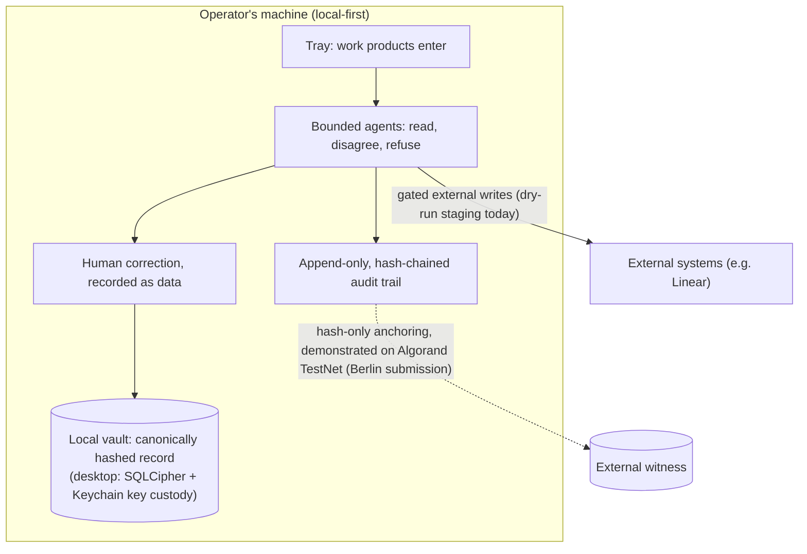

# Liminal (public prototype)

**Live demos: <https://liminalshruti.github.io/liminal-prototype/>**

Liminal is a local-first judgment and control layer for organizations operating with AI agents.

The organizational problem: when agents produce most of the work, output stops being the bottleneck and judgment becomes it. Agent work products look finished while silently dropping load-bearing requirements, nobody can say afterwards who decided what, and the human corrections that catch these misses evaporate instead of becoming institutional memory. Liminal is an exploration of how an organization keeps five things while operating with agents: authority (a human owns the decision), provenance (every claim traces to its source), correction (human pushback is recorded as first-party data, not lost in chat scroll), institutional memory (the record compounds locally), and accountability (a tamper-evident trail of who did what).

## The loop

1. **Drop work in.** A window, doc, transcript, or agent session enters the Tray. No pipes, no integrations required.
2. **Bounded agents read it.** Specialists with explicit boundaries read what is there. They disagree with each other. Out-of-lane agents refuse and name the right one; refusal is a designed output, not a failure state.
3. **The human corrects.** When the operator pushes back on a read, the semantic delta is recorded as first-party data. The correction, not the AI's read, is the product.
4. **The vault holds the record.** Local-first: every session and correction is canonically hashed and searchable on the operator's machine.
5. **One accountable next move.** The loop ends in a packet a human can stand behind, and gated writes to external systems rather than silent side effects.

The architectural bet: better models deepen this loop instead of eroding it. Higher-resolution reads produce more interesting disagreements, which produce richer corrections, which compound in the vault. (A bet, not a demonstrated result: the cuts below show the bounded-refusal loop running, not a weak-vs-strong-model comparison.)

## System context

How the pieces relate across the Liminal codebase. Status per component is labeled honestly; this catalog is the public demo surface, not the product itself.



| Surface | What it is | Status |
| --- | --- | --- |
| This repo | Interactive demo cuts + the canonical design-token substrate | Public, live on GitHub Pages |
| [liminal-engine](https://github.com/liminalshruti/liminal-engine) | The governance loop (observe, detect, correct, enforce, audit, improve) with the hash-chained audit ledger. Deep dive: [the hash-chained audit ledger](https://github.com/liminalshruti/liminal-engine/blob/main/docs/technical/hash-chained-audit-ledger.md) | Public, MIT, tested (`pnpm verify`) |
| [algorand-berlin-2026](https://github.com/liminalshruti/algorand-berlin-2026) | Hackathon submission: agent commerce with on-chain provenance anchoring and a settlement-refusal guard | Public, archived as shipped |
| Liminal desktop + agent substrate | The product: Tauri desktop vault and the agents-v1 substrate library | Private, in active development |

## A concrete workflow you can run right now

Open [cut 09, OSINT Custody](https://liminalshruti.github.io/liminal-prototype/cuts/09-osint-custody.html). The custody kernel runs the full loop live in your browser on every run: six bounded specialists read the material, a structural guard checks their output, competing hypotheses are re-ranked under review rules, and the run lands in a vault/audit view. Then open [cut 11, Govern](https://liminalshruti.github.io/liminal-prototype/cuts/11-govern.html), where correction is the primary interaction and the record reflects back. What is live computation versus deterministic fixture is labeled inside each cut; see "Status: what's shipping vs. designed" below.

## What's in this repo

This is a **single-file prototype catalog** — public, click-able embodiments of the four loops above PLUS the **canonical visual substrate** that every Liminal product surface consumes.

| File | What it is |
| --- | --- |
| `index.html` | The cuts catalog — single self-contained file (HTML + CSS + JS, no build step) |
| `cuts/00-agency.html` | **The Agency master.** ONE shell + ONE loop where the *subject is a parameter* — switch between pattern · notification · custody · OSINT · spend. Each subject reskins the four registers and swaps its evidence pane, so the distinctive charts from cuts 01/02/08/09/11 are preserved as per-subject panes ("the kernel travels"). Real Tray→Slate composition + orbital agent-coverage viz with refusal arrows. (Spec: `CUT_CONSOLIDATION_MAP.md`.) |
| `cuts/01-slate-tray.html` | **Canonical front door** (per `FRONT_DOOR_DECISION_2026-05-12.md`) — slate-tray-vault workspace, brand-first hero. (The speedrun-register hero is a toggle inside this cut; the former `01-slate-tray-speedrun.html` + `00-hero-demo.html` were consolidated to `cuts/_archive/` on 2026-06-02.) |
| `cuts/02-forensic-agent.html` | Forensic agent · contradicting-notification diligence loop (v0.3) |
| `cuts/03-calibration.html` | 12wk × 4-register vault heatmap — the moat-visibility cut (renders a seeded illustrative baseline with any real corrections merged on top; see the cut's own in-UI disclosure) |
| `cuts/04-onboarding.html` + `cuts/onboarding/*` | First-touch onboarding (JSX/CSS in `cuts/onboarding/`). Consolidates three earlier explorations now in `cuts/_archive/`: Cut 05 Argument ("the redline IS the onboarding"), Cut 06 Compare (7-step vs 3-step), Cut 07 Radical (3 steps, "the delta IS the onboarding"). |
| `cuts/08-liminal-custody.html` | Natsec-register custody view (DoD/IC audience) |
| `cuts/09-osint-custody.html` | **OSINT Custody — wired to the real kernel.** Runs INGEST→READ→GUARD→REVIEW→VAULT live in-browser via `lib/osint-kernel.bundle.js` (real loop, recomputed each run). Custody/DISCORD register toggle. Displays a **recorded** Kafka + Algorand provenance snapshot from `lib/osint-run.json` (current: localnet, not publicly verifiable) — see "OSINT Custody" §below. |
| `cuts/10-today.html` | Today · re-entry — the loop closes; held compositions re-read overnight (renamed from `09-today` on 2026-06-11 to resolve a slot collision) |
| `cuts/11-govern.html` | **Govern — the Agency Loop.** The canonical govern cut: shell + reconciled Agency Loop + folded HCI fixes. Correction is the *primary* interaction, the loop returns (Today/Re-enter), the record reflects back (Mirror); ⌘K palette, OKR allocation bar + agent-fit cost-swap. Absorbed `_archive/11-govern-cockpit-iter.html` + `_archive/12-agency-govern-iter.html`. (Spec: `HCI_AUDIT.md` + `RECONCILED_SYSTEM.md`.) |
| `cuts/_template.html` · `cuts/_console.html` · `cuts/_explore/` | Internal tooling: `_template.html` is the starting shape for a new cut; `_console.html` is the **Substrate Console** — a complete directory of every surface (jump) plus all live cuts side-by-side as a click-to-load coherence scan (survey), with a working-tree banner fed by the dev server's `/__state` endpoint so parallel sessions see each other's in-flight work; `_explore/frontdoor-synthesis.html` is the converged front-door concept (2026-07-28) — the candidate replacement for the theliminalspace.io homepage; its predecessors (frontdoor directions A/B/C, ledger-directions, onboarding-variants) are preserved on the `archive/design-concepts-2026-07-28` branch, not in the working tree. Retired cuts and frozen baselines live in `cuts/_archive/` (incl. `root-experiments/` — frozen `index-v0.3.7`/`v0.4` + the ontology-agent-travel 3D series). |
| `lib/osint-kernel.bundle.js` | Browser build of the `liminal-test` custody kernel. Real deliberation + 7-layer structural guard + review-rule re-rank, no backend. **Frozen artifact** — `liminal-test` source is no longer in the workspace, so `npm run build:kernel` can't currently regenerate it (see "OSINT Custody" §below). |
| `molehunt/index.html` | Counterintelligence analyst console (self-contained, high-assurance) |
| `team-drift/index.html` | Team coherence telemetry (governance-as-pipe) |
| `design-system/tokens/design-tokens.css` | The token file the cuts link — a **synced consumer copy** of the upstream canon at `liminal-creative/tokens/design-tokens.css` (see "lockstep-canon contract" §below). Don't edit values here; run `npm run tokens:sync` to pull from canon, `npm run tokens:check` to verify (CI guard). |
| `lib/cut-shell.css` | Frame chrome + slate/tray + audit ribbon + classification + boot animations. (Also carries a `:root` ink-token fallback block that must track canon — re-sync on any ink-token change, else it shadows the linked tokens.) |
| `lib/brand-upgrade.css` | Brand fonts (PerfectlyNineties + NinetiesHeadliner) + type hierarchy |
| `design-system.html` + `design-system/` | Design tokens browser, type ramp, motion specimens |
| `server.mjs` | Zero-dependency dev server with live reload |
| `FRONT_DOOR_DECISION_2026-05-12.md` | Lock: cut 01-canon is the single front door for all audiences |
| `embed-*.html` | Embeddable demos (Tray + Slate, agent hackathon cut, vault) |

## The lockstep-canon contract

Every Liminal product surface consumes **one** token vocabulary, so a brand change lands everywhere from a single edit. The contract — stated since 2026-04-07 in the token-file header — is:

> *"Every product surface (this prototype, the marketing site, the Tauri desktop client, future mobile, etc.) consumes the canonical token set — and ONLY that set."*

**The canon topology (verified 2026-06-11):**

```
            liminal-creative/tokens/design-tokens.css
            ─────────────────────────────────────────
                    upstream canon (superset)
              named chrome + iridescent content +
              paper aliases + 12-wheel tonal scales

                    │            │            │
        ┌───────────┘            │            └───────────┐
        ▼                        ▼                        ▼
  liminal-prototype       liminal-desktop          (marketing site,
  design-system/          public/styles/            future mobile)
  tokens/design-          design-tokens.css
  tokens.css              ← in sync w/ canon
  ← synced 2026-06-11       (verified, 0 drift)
```

**Single-source consumption is the contract; sync is the discipline that enforces it.**
The honest status as of 2026-06-11 (stated at the layer actually measured):

- `liminal-desktop`'s linked CSS (`public/styles/design-tokens.css`) matches the upstream canon at the **file-diff** layer — zero value drift, no missing tokens (verified by full token-set diff; *not* render-verified — render depends on each surface's load order, see next bullet).
- This prototype's canonical token file (`design-system/tokens/design-tokens.css`) and the `lib/cut-shell.css` fallback were synced forward from canon on 2026-06-11 (`--text-faint` a11y value + `--paper-*` aliases).
- **Render-layer override: CLOSED (2026-07-29, single-ink-source ruling).** `lib/brand-upgrade.css` no longer declares surface or ink values at all, and the per-surface local `:root` re-pins (index, team-drift, the three embeds) are gone. Every surface renders the canonical ink scale directly from the token file, so file-level lockstep now equals render-level lockstep **by construction**: there is no later-loading value left to shadow canon. The caveat this bullet used to carry (a last-loading override silently shadowing canon) is preserved in git history as the proof of why single-source-by-construction matters.
- **Re-derived parallel systems (Panda CSS, Tailwind, etc.) are the contract's other weak point.** `liminal-desktop` uses Panda (`panda.config.ts`); its tokens must mirror canon and re-sync on every change. Panda's `--text-faint` mirror was re-synced at source 2026-06-11 (verified: `panda codegen` regenerates `--colors-frontier-text-subtle: #6B6862` in the generated `styled-system/`, stale value gone).

### Implications for downstream maintainers

- **Adding a new visual primitive?** It lands here first (`cuts/_template.html` for new cut shapes, or `lib/cut-shell.css` for shared component classes). Downstream surfaces consume on next deploy.
- **Changing a token value?** It lands here. All consumers update simultaneously on next page load.
- **Need a divergent treatment for a specific audience?** Build a new cut (e.g., cut 08 natsec). Cuts are how this canon serves multiple audiences without forking the substrate.
- **Anointment cycles (v0.9.0 / v0.9.1 / v0.9.2 / v0.9.3)** happen on cuts in this repo. Each anointment is per-cut, scoped to that cut's `<style>` block, reversible by deleting the named block. Locked moves promote to `lib/cut-shell.css` once stable across multiple cuts.

### Why this matters

The architectural discipline is the moat. Liminal isn't shipping one product — it's shipping a substrate that ships AS multiple surfaces (desktop pilot, Tauri prod, future mobile, marketing site, natsec custody) without fragmenting. Single-source canon + cut-shape-appropriate consumption is what makes the portfolio coherent. The lockstep contract is what keeps it that way.

## Status: what's shipping vs. designed

Honest line between what runs today and what is built-but-not-yet-wired or roadmapped. This catalog is a prototype; keeping the line explicit is the point.

| Capability | Status |
| --- | --- |
| Bounded agents · refusal-as-output | **Shipping (in-browser)** — the custody kernel (cut 09) recomputes the full loop client-side each run; the other cuts choreograph the same loop over deterministic fixtures (labeled in-surface). |
| Packet contract · canonical hashing | **Shipping** — implemented and tested in the `agents-v1` substrate (golden-test pinned); consumed by `liminal-desktop` for hashing. |
| Canonical token lockstep | **Shipping** — single token vocabulary. Desktop's linked CSS in exact sync (2026-06-11, Panda codegen). This prototype re-synced to canon 2026-06-16 (was 171 vars behind) + now has `tokens:sync`/`tokens:check` + an opt-in pre-push hook (`scripts/tokens/pre-push-check.sh`) so drift is caught locally before it ships. (CI guard skipped: canon is a private sibling repo — cross-repo CI checkout needs a secret; local guard chosen instead.) Symlink ruled out (cross-repo symlink dangles on Pages deploy); flat-copy + sync-discipline is the mechanism. |
| Vault encryption-at-rest · packet signing | **Encryption shipped on desktop main (as of 2026-08):** the Tauri vault supports SQLCipher with macOS-Keychain-only key custody, and spend-governance commands fail closed if the vault file is plaintext (enforced in `require_encrypted_spend_vault`, covered by a SQLCipher integration test). Packet signing: **implemented on desktop main** (correction 2026-08-04; an earlier revision of this row said "designed, not yet implemented", which was inaccurate). Decision packets are signed with Ed25519 device signatures (key held in the macOS Keychain, alg `ed25519:v1`); audit records remain hash-chained and tamper-evident, and the hash-chained ledger itself is not signed. |
| On-chain provenance (cut 09) | **Recorded snapshot** — a real custody run was anchored once (localnet, 2026-05-28); a publicly-verifiable testnet anchor is roadmapped. |
| Real model agents (desktop) | **Partial** — agent pipeline exists; desktop falls back to heuristic reads when no model client is wired. |

## Receipts

- **Algorand Builders Berlin, Agentic Commerce x402 Hackathon (Jun 6-7, 2026): 1st place, Main Track 2: Infrastructure / Existing Projects.** x402 agent commerce on Algorand with hash-only on-chain provenance anchoring and a settlement-refusal guard. The submission repo is public and archived as shipped ([algorand-berlin-2026](https://github.com/liminalshruti/algorand-berlin-2026)); its `audit/LATEST.md` lists TestNet transaction ids that resolve on any Algorand explorer, and the [demo page](https://liminalshruti.github.io/algorand-berlin-2026/) is live.
- **AI Agent Economy Hackathon (Apr 25, 2026):** Judge feedback called the *refusal-as-designed-output* framing "the most original architectural idea in the cohort."
- **NatSec Hackathon (Cerebral Valley × Palantir × USDoD × OpenAI):** Top 16 of 102 finalists. Architecture applied to defense use case — *do not automate the moral lever, equip the human holding it.*
- **a16z Speedrun SR007:** Applied May 6, 2026. Application ID `f952b90c-5099-4e3b-af17-555306085b7f`.

## Team

- **Shruti Rajagopal** — Founder, CEO. UC Berkeley (Cognitive Science + CS). PM at Asana, Cloudflare, Robinhood, Ancestry. Background in Jungian psychology and somatic practice.
- **Sean Nejad** — Co-founder, Engineering. Security and trust-boundary architecture. 11-year collaborator.

## Run locally

```bash
npm run dev
```

Open <http://localhost:5173>. Live-reloads on any `.html` / `.css` / `.js` change.

## OSINT Custody — the real kernel (live), recorded infra (snapshot)

Two distinct claims here; keeping them separate is the honest framing.

**The kernel loop runs live, client-side — this is real, not a scripted mock.**
`cuts/09-osint-custody.html` imports `lib/osint-kernel.bundle.js` and runs the full loop
(six bounded specialists → 7-layer structural guard → competing hypotheses → review-rule
re-rank → vault/audit) in the browser, recomputing verdicts on every run. The bundle was
built from the custody kernel in the sibling `liminal-test` repo.

> **Reproducibility note:** `liminal-test` is no longer in the workspace, so
> `npm run build:kernel` cannot currently regenerate the bundle from source — the committed
> `lib/osint-kernel.bundle.js` is a frozen artifact. Restore the `liminal-test` source (or
> re-vendor the kernel) before relying on a rebuild.

**The Kafka + Algorand provenance the cut displays is a recorded snapshot, not a live feed.**
The infra tier (Redpanda + an Algorand anchor) cannot run inside a static page; it was run
once in `liminal-test`, which wrote `lib/osint-run.json` (current snapshot: localnet,
2026-05-28). Cut 09 reads that file and renders the recorded Kafka offsets and Algorand txid.
Because the snapshot is **localnet**, the txid only resolves against the runner's own node —
it is not publicly verifiable, so the cut renders it as static text (no explorer link) and
does not badge it "verified." A public-`testnet` run would produce a verifiable txid and an
explorer link; that is roadmapped, not yet done.

To regenerate the snapshot (requires the `liminal-test` source restored):

```bash
cd ../liminal-test
docker compose up -d            # Redpanda (Kafka API broker)
algokit localnet start          # local algod/kmd/indexer  → localnet anchor (not publicly verifiable)
bun run infra:local             # custody loop → Kafka round-trip → Algorand LOCALNET anchor
# Or, for a publicly-verifiable anchor (needs a funded account):
bun run infra                   # → testnet · writes lib/osint-run.json · txid resolves on algonode explorer
```

Switch networks with `LIMINAL_ALGO_NETWORK=localnet|testnet`.

## License

MIT.

---

*Liminal gives form to inner life.*

<https://theliminalspace.io>
